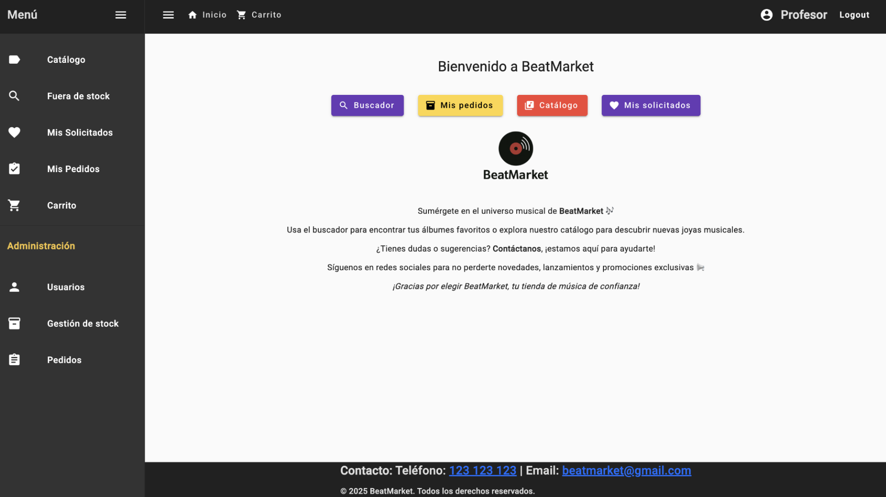
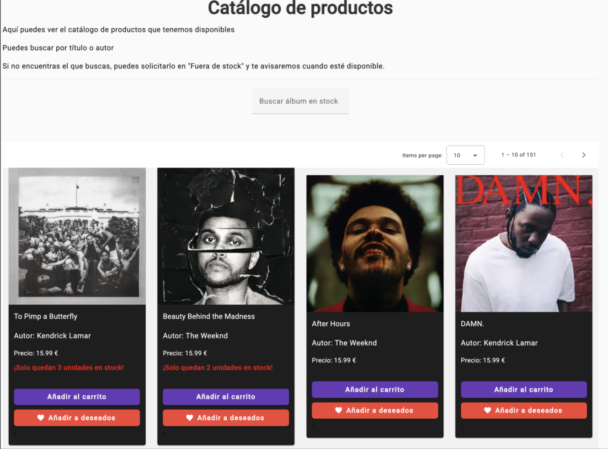
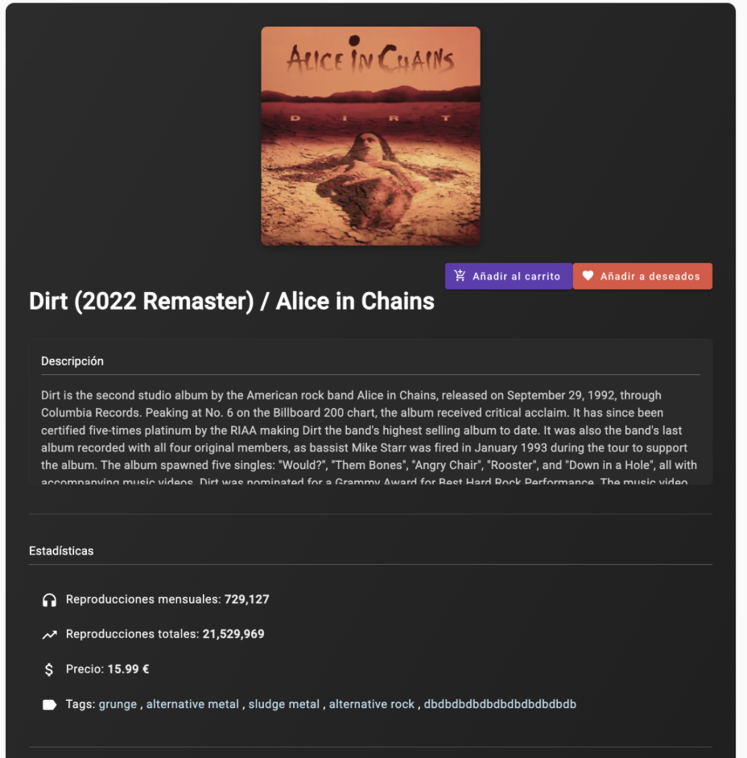
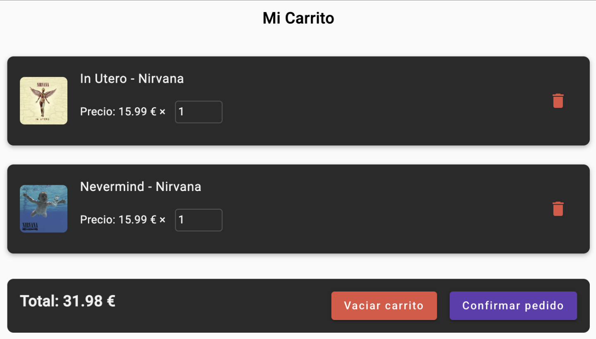

# BeatMarket Frontend

Angular frontend for **BeatMarket**, a music e-commerce platform developed as my final degree project for Multiplatform Application Development (DAM).

This repository contains the Angular frontend application. The project was designed to work with a Spring Boot REST API backend.

## Tech Stack

- **Framework:** Angular
- **Language:** TypeScript
- **Markup & Styling:** HTML, SCSS
- **Authentication:** JWT integration
- **API Communication:** REST API integration
- **Tools:** Angular CLI, npm

## Features

- Product catalog for albums, vinyl records and music-related products
- Product detail pages
- User registration and login
- JWT-based authentication flow
- User role-based navigation
- Shopping cart
- Order management views
- Responsive user interface
- Integration with a Spring Boot backend API

## Screenshots

### Home



### Product Catalog



### Product Detail



### Shopping Cart



## Project Structure

```text
src/
├── app/
├── assets/
└── environments/

angular.json
package.json
README.md
```

## Getting Started

### Prerequisites

- Node.js
- npm
- Angular CLI

### Installation

```bash
npm install
```

### Development Server

```bash
ng serve
```

Then open:

```text
http://localhost:4200/
```

## Backend

This frontend was developed to communicate with a Spring Boot REST API backend.

Backend features include:

- REST API endpoints
- JWT authentication
- User roles
- Shopping cart and order management
- MySQL database
- Oracle Cloud deployment

## Notes

The original backend deployment was hosted on an Oracle Cloud virtual machine during development. The public demo is currently not available because the cloud trial period has ended.

## Status

This project was developed as a final degree project and is no longer actively maintained.

## Author

**Karim Rozanov Zinnatullin**  
[GitHub](https://github.com/Layne2002)
